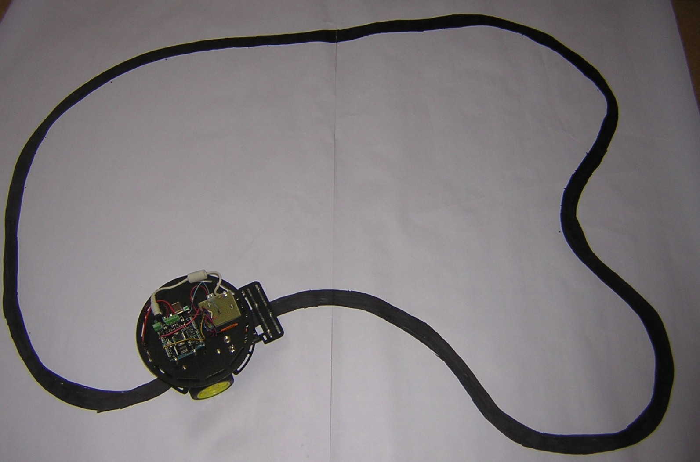

# AutomaticRobot_Arduino
This is an Arduino Software to let a robot, follow automatically a black line on a white paper

- you can found more info here: 
http://deasproject.altervista.org/blog/arduino-robot-automatico/

- This is a video of the robot with this software 
https://www.youtube.com/watch?v=VXZSRMd1oQs&list=PL_U86ow0dBahoo9M_iaQS_9Ln_8tCr9ew

